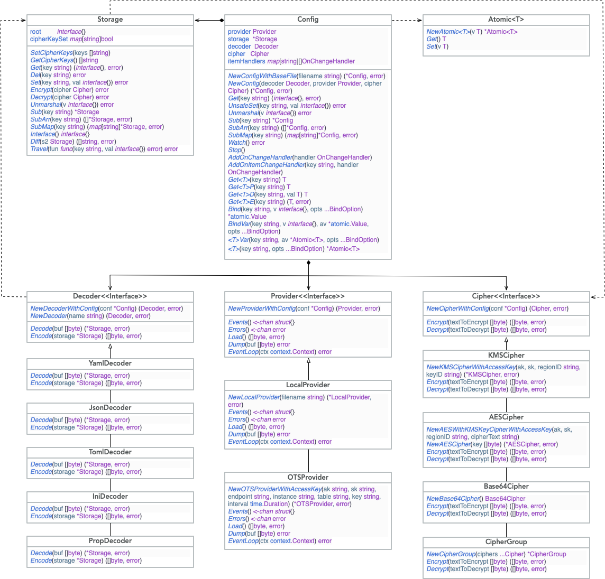

# config

## 设计目标

1. 更灵活的配置格式支持，yaml, json5, toml, xml, ini, properties，配置格式可拓展
2. 多种数据源支持，支持本地和 ots，数据源可拓展
3. 提供灵活安全的动态更新机制
4. 提供方便的加解密功能

## 设计思路



- `Config`: 配置类
- `Storage`: 配置的内存存储结构
- `Atomic<T>`: 动态配置项，原子类，支持 `Get/Set` 操作
- `Decoder`: 数据格式解析或者生成接口，支持 `Encode/Decode` 编解码操作
- `Cipher`: 数据加解密接口，支持 `Encrypt/Decrypt` 加解密操作
- `Provider`: 数据源抽象，支持 `Load/Dump` 数据加载和写入操作

### Config

配置构造

- `NewConfigWithBaseFile`: 通过一个本地文件构造配置对象，建议命名 `base.json`
- `NewConfig`: 通过基础组件构造配置对象

动态数据获取

- `Get<T>`: 获取值，如果未获取到，使用初始值
- `Get<T>P`: 获取值，如果未获取到，panic
- `Get<T>D`: 获取值，如果未获取到，使用参数提供的默认值
- `Get<T>E`: 获取值，如果未获取到，返回 error

动态数据绑定

- `Bind`: 返回一个绑定了配置项的原子变量，类型由参数指定
- `BindVar`: 将配置项的值绑定到一个原子变量上，类型由参数指定
- `<T>`: 返回一个绑定了配置项的 `Atomic<T>`
- `<T>Var`: 将配置项的值绑定到一个 `Atomic<T>`

结构体映射

- `Unmarshal`: 将一组配置项映射到结构体中

子配置

- `Sub`: 以 key 为前缀的所有配置项组成的子配置
- `SubArr`: 以 key 为前缀的所有配置项组成的子配置数组
- `SubMap`: 以 key 为前缀的所有配置项组成的子配置字典

事件监听

- `AddOnChangeHandler`: 增加事件监听回调
- `AddOnItemChangeHandler`: 增加 Item 事件监听回调

事件循环

- `Watch`: 启动协程检测配置更新，自动触发回调
- `Stop`: 停止检测配置更新协程

配置修改

- `UnsafeSet`: 修改指定配置项，如果配置项不存在，则新增配置项，线程不安全

### Storage

KV操作

- `Get`: 获取 key 的值
- `Del`: 删除指定 key
- `Set`: 设置 key

加解密操作

- `Encrypt`: 将 `cipherKeySet` 中的 key 使用传入的 `Cipher` 进行加密，并给 key 增加 `@` 前缀
- `Decrypt`: 将叶子节点中 `@` 前缀的数据使用传入的 `Cipher` 解码，将 key 中的 `@` 删除，并将这些 key 保存到 `cipherKeySet` 中
- `SetCipherKeys`: 设置需要加密的 key
- `GetCipherKeys`: 获取需要加密的 key

结构体映射

- `Unmarshal`: 将 Storage 中的存储信息映射到一个结构体中，使用字段名作为 key

子 Storage

- `Sub`: 获取 key 节点的数据
- `SubArr`: 获取 key 节点的数据并转换成一个 slice 返回
- `SubMap`: 获取 key 节点的数据并转换成一个 map 返回

其他

- `Interface`: 返回 root 节点的 interface，`Decoder` 可获取 interface 来序列化
- `Travel`: 遍历所有的叶子节点
- `Diff`: 比较两个 `Storage` 之间不一样的 key，相当于集合操作中的差集，注意是 s1 - s2，而非 (s1-s2) ∪ (s2-s1)

### Decoder

- `Decode`: 将特定格式的字节数据解码成一个 Storage
- `Encode`: 将一个 Storage 编码成特定格式的字节数据

支持 yaml，json，未来支持 toml，ini，prop

### Cipher

- `Encrypt`: 加密
- `Decrypt`: 解密

实现

- `KMSCipher`: 通过 KMS 的 `Encrypt` 和 `Decrypt` 接口加解密
- `AESCipher`: 通过 AES 的 CBC 模式加密，使用小于 32 位的字节串作为密码（不够32位会用 `\0` 填充），使用随机数自动生成 16位 `iv`，将 `iv` 填充在加密内容的头部
- `Base64Cipher`: 使用 Base64 编解码
- `CipherGroup`: 将多个 `Cipher` 组合成一个 `Cipher` 来使用，加密时会依次调用每个 `Cipher` 的加密方法，解密是会逆序依次调用每个 `Cipher` 的解密方法

实践中推荐使用中会使用 KMS 加密密码，使用密码的 AESCipher + Base64Cipher 构造一个 CipherGroup 作为配置的 Cipher

### Provider

源数据获取写入

- `Load`: 从配置源获取数据
- `Dump`: 将数据写入配置源

事件更新

- `Events`: 事件 channel
- `Errors`: 错误 channel
- `EventLoop`: 进入事件循环，启动协程，检测配置源数据变化

实现

- `LocalProvider`： 本地文件配置源，通过 `fsnotify` 获取更新事件
- `OTSProvider`：OTS 数据配置源，定期请求 OTS，检查返回时间戳，当时间戳变更时，触发更新事件；OTS 表仅有两列，主键 `Key` 列和文件名对应，`Val` 列和文件内容对应，所有的配置内容放到一列中，OTS 有单 cell 2M 限制，实际测试中可以支持 5W 行的配置文件，可以满足需求

### 配置工具

提供一个配置管理命令行工具，提供如下功能

```sh
# base.json 中定义了构造 config 所需要的信息，包括 Provider/Decoder/Cipher
# 从配置源中获取指定 key 的配置
config-tool --base base.json --get [--key key] [--encrypt] [--decoder ini]
# 设置配置源指定 key 的值为 val，可以使用 --try 参数查看会产生的变更，而不真正执行 Set
config-tool --base base.json --set --key key --val val [--encrypt] [--try]
# 将配置文件推到配置源，可以使用 --try 参数查看会产生的变更，而不真正执行推送
config-tool --base base.json --set --file file [--try]
```

### 配置文件管理

将加密的配置文件通过 git 管理起来，方便配置的 review 以及版本的管理，每次变更通过 config-tool 推送整个配置文件

### 配置版本更新

内置一个特定的配置项 `Version`， 这个配置项由 Config 对象更新时使用，第一次配置加载时会将 `Version` 字段的值保存，配置更新时，如果 `Version` 的值发生变化，则不会加载配置，这样在配置更新时，老的服务不会加载新的配置
